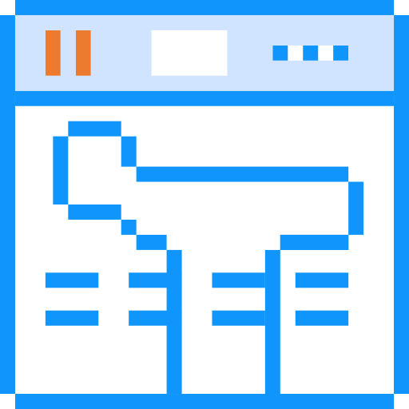

# Moon Tab - 简洁的新标签页扩展



一个简洁美观的浏览器新标签页扩展，提供书签管理、倒计时卡片和个性化搜索等功能。

## 功能特性

- 🏠 可自定义的新标签页
- 📌 多尺寸书签卡片管理
- ⏱️ 倒计时卡片
- 🔍 多搜索引擎切换
- 🎨 个性化背景设置
- 📱 响应式布局

## 技术栈

- Vue 3 + TypeScript
- TDesign Vue Next UI组件库
- Pinia状态管理
- LocalForage本地存储
- Vite构建工具

## 项目结构
src/
├── components/       # 公共组件
│   ├── card/        # 卡片组件
│   ├── dialog/      # 对话框组件
│   ├── form/        # 表单组件
│   └── status/      # 状态组件
├── page/            # 页面组件
│   ├── add-card/    # 添加卡片页面
│   ├── search-bar/  # 搜索栏
│   ├── swiper/      # 卡片轮播
│   └── system-settings/ # 系统设置
├── store/           # 状态管理
│   ├── indexedDB.ts # 本地数据库
│   ├── swiper.ts    # 卡片状态
│   └── wallpaper.ts # 壁纸状态
├── utils/           # 工具函数
│   ├── eventBus.ts  # 事件总线
│   ├── system.ts    # 系统工具
│   └── wallpaper.ts # 壁纸工具
└── types/           # 类型定义

## 开发指南

### 安装依赖

```bash
pnpm install
```

### 开发模式

```bash
pnpm dev
```

### 构建生产版本

```bash
pnpm build
```

### 打包发布

```bash
pnpm build:zip
```

### ZH
1. 基本功能
- 新标签页替换 ：替换浏览器默认新标签页
- 卡片管理 ：支持添加/编辑/删除书签卡片
- 个性化设置 ：可更换背景壁纸和调整布局

2. 测试账户
- 无需登录账户
- 所有数据存储在本地IndexedDB
### EN 
1. Basic functions
- New tab replacement: Replace the default new tab in the browser
- Card management: supports adding/editing/deleting bookmark cards
- Personalized settings: adjustable background wallpaper and layout

2. Test account
- No need to log in to the account
- All data is stored locally in IndexedDB